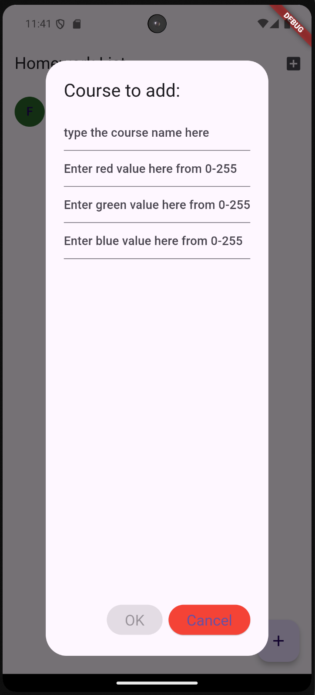
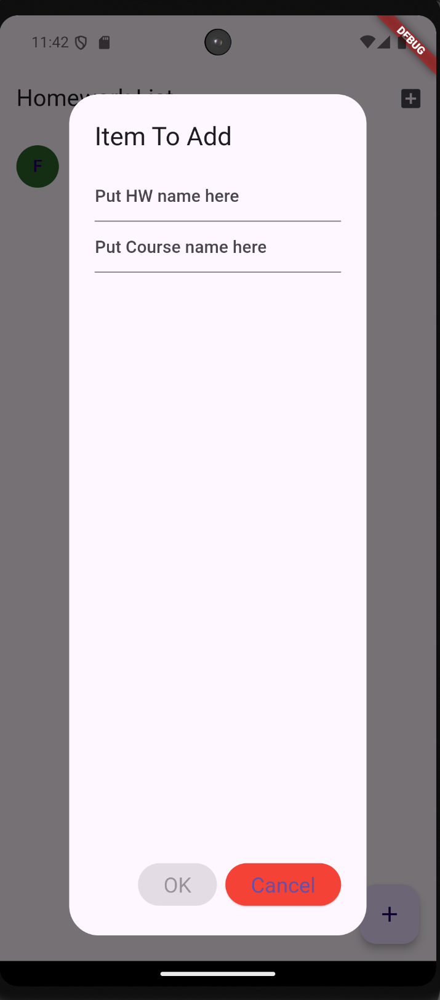
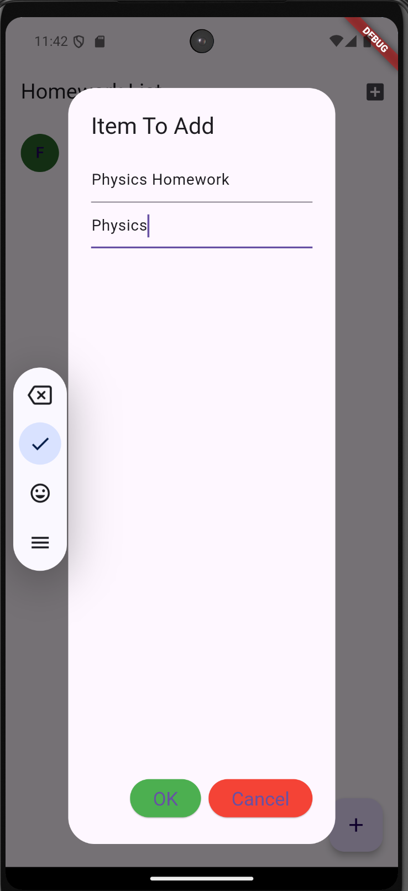
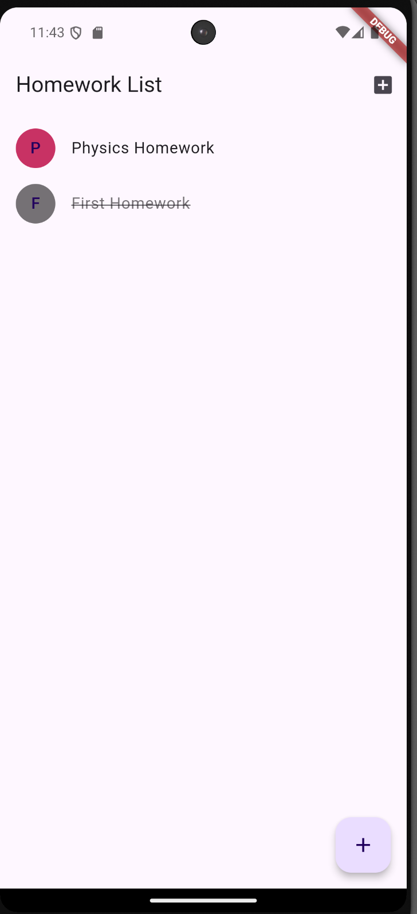

# Homework To Do List

## Who it's for
This app is intended for high-school and college students.

## What does it do?
This app keeps track of homework. You can create different courses for each course you have homework for then 
create a homework item that uses that course to determine its color. You can mark homework as completed and
then remove it if you so desire.

## Why is this useful?
For students, this is very useful to stay on top of homework and know what is left to do.

## Screenshots:

### Initial Start-up Screen

The IconButton in the top right opens the dialog to create a new course and the FAB opens the dialog to create a new Homework item.

### Empty New Course Dialog

This is the dialog to create a new course. You enter a String for the name and integers for the RGB values.

### Filled Out Course Dialog

This will create a Physics course that will give any homework that it's assigned to the color from the RGB values.

### Empty New Homework Dialog

This is the dialog to create a new homework item. You give it a String for the name and a String for the course name.
The course name has to be an exact match or it will not create the homework item.

### Filled Out Homework Dialog

This will create a Physics Homework item that is assigned the Physics course and will use the color value from the Physics course.

### Main Screen With New Homework Item

If you tap on an item, it will switch to completed.

### Completed Item

If you long press on a completed item, it will delete the item.

### Deleted Item

The item is now deleted and no longer appears.
